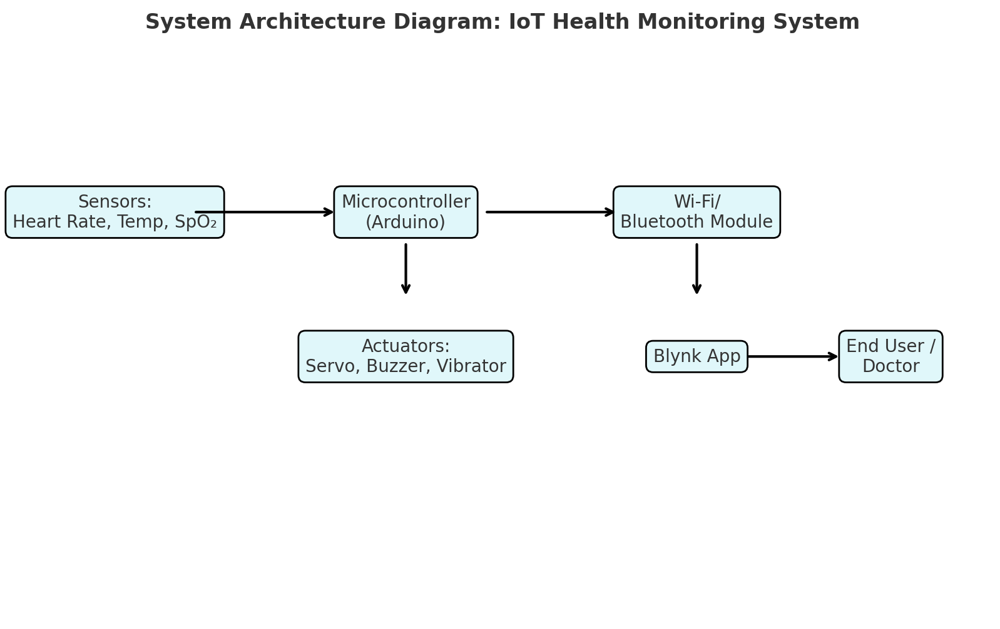
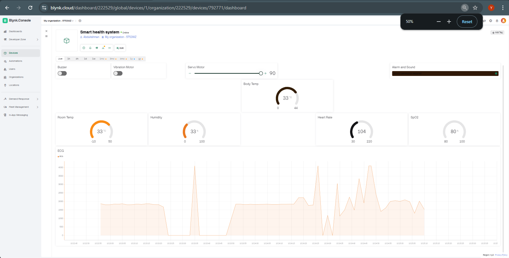

# IoT Health Monitoring System  

An 'IoT-based health monitoring system' designed to track vital signs such as heart rate, temperature, and blood pressure using sensors, PCB design, and embedded systems. The project demonstrates how technology can be used to support healthcare delivery, especially in resource-limited settings.  

# Features of the IoT Health Monitoring System  

# Hardware & Embedded System  
- Designed and programmed using Arduino IDE (C/C++)  
- Integrated sensors (heart rate, temperature, SpO₂) with microcontrollers  
- Controlled actuators such as:  
  - 'Servo' motors for pill dispensing  
  - 'Buzzer' for alert notifications  
  - 'Vibrators' for patient feedback and reminders  
- Real-time signal acquisition and data processing at the edge  

# IoT & Connectivity  
- Implemented 'wireless data transmission' via Wi-Fi/Bluetooth modules  
- Sent health data to the 'Blynk App' for real-time monitoring and visualization  
- Enabled 'remote patient tracking' through mobile interface  

# System Design & Integration  
- Developed 'custom PCB design' for compact and reliable hardware  
- Integrated power management for continuous operation  
- Ensured modular design for easy upgrades and scaling

# How It Works

1. Data Collection 
   - Biomedical sensors (e.g., heart rate, temperature, SpO₂) capture real-time health data.  
   - The Arduino board reads sensor values through its analog and digital pins.  

2. Processing & Control 
   - The Arduino IDE code processes the data and applies threshold logic.  
   - If abnormal readings are detected, actuators (servo motor, buzzer, and vibrator) are triggered to alert the user or dispense medication.  

3. Data Transmission  
   - The processed health data is sent to the **Blynk IoT app** via Wi-Fi (ESP8266/ESP32 module).  
   - The app provides real-time monitoring and visualization of the data.  

4. User Alerts & Actions 
   - Buzzer & Vibrator: Immediate local alerts when health readings cross dangerous thresholds.  
   - Servo Motor: Controls the automatic pill dispenser to release medication at the right time.  
   - Blynk Notifications: Sends alerts to caregivers or doctors through the app.  

# Project Media

- Architecture Diagram:
Below is a high-level architecture showing how the system works: 

- Below is Blynk dashboard Image:
 

# Future Improvements
- Cloud integration for remote monitoring  
- Mobile app for real-time alerts  
- Machine learning for predictive health analysis  
- Improved energy efficiency for long-term use
- Integrate AI/ML algorithms for predictive health analytics  
- Apply deep learning for anomaly detection in patient data  
- Use reinforcement learning for adaptive system optimization    

# Author
'Idris Bello Akande'  
- Aspiring PhD researcher | Mechatronics, IoT, Robotics, AI/ML & Deep Learning | Cyber-Physical Systems for healthcare and autonomous technologies. 
- Focus: My focus lies at the intersection of Mechatronics, IoT, and AI/ML-driven Cyber-Physical Systems, with applications in healthcare technologies, robotics, and autonomous systems. I am particularly interested in how deep learning can enhance resilience, safety, and security in CPS such as medical devices, surgical robots, and smart assistive technologies.
